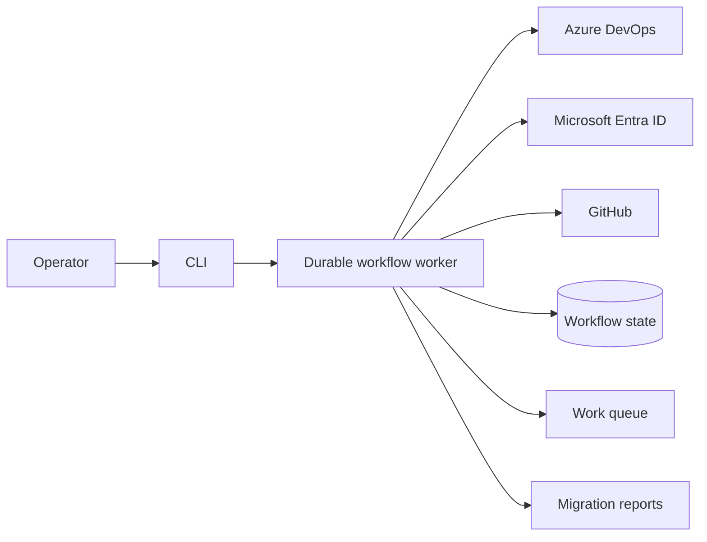

# Architecture

This document describes the system boundaries, execution model, and safety properties of
`ado-to-github-teams`. For operator instructions, see [Using the CLI](using-the-cli.md).

## System context

The CLI validates input, starts or reconnects to a workflow, presents status, and records operator
decisions. The worker owns migration orchestration and provider access. Provider adapters translate
external payloads and failures into domain types; migration logic does not depend directly on
provider SDKs.

## Migration flow

1. Read Azure DevOps teams and memberships.
2. Resolve Azure DevOps identities through Microsoft Entra ID.
3. Match resolved identities to GitHub organization members.
4. Build and persist the proposed team, membership, and optional repository-grant plan.
5. Write a dry-run report or pause an apply run for approval.
6. Create approved teams, assign approved memberships, and grant approved repository roles.
7. Persist progress after every resumable unit and produce the final report.

The default flat flow maps Azure DevOps teams directly to GitHub teams. Topology mode first builds
an explicit hierarchy and repository grant plan. See
[ADR 0002](decisions/0002-explicit-team-topology.md).

## Durable execution

The worker uses the Workflow Development Kit with a pluggable World:

- `@workflow-worlds/turso` persists workflow events, hooks, steps, and streams in SQLite.
- `@fantasticfour/world-nats-jetstream` delivers workflow and step work through NATS JetStream.
- Litestream replicates the SQLite database to a JetStream Object Store bucket in the supplied
  Compose deployment.

The local World re-enqueues active runs at startup and periodically reconciles runs that may have
been persisted immediately before a queue interruption. Replayed work uses checkpointed,
idempotent units so completed writes are not intentionally repeated.

The default database path outside Compose is
`~/.ado-github-teams/workflow.db`. The Compose stack stores it in the `workflow-data` volume and
uses a separate `nats-data` volume for JetStream.

The supplied Compose topology is a single-host deployment. Its default backup target is co-located
with the live queue and is suitable for development and evaluation, not high availability. A
production deployment must provide failure-independent backup or use another explicitly enabled
World such as `@workflow/world-postgres`. See
[ADR 0001](decisions/0001-durable-workflow-runtime.md).

## Safety model

### Approval

Dry run is the default. `--apply` expresses write intent but does not bypass approval. The exact
persisted changes are presented before each write phase, and the operator decision is stored before
execution resumes.

### Idempotency and recovery

Each completed team, membership, and repository grant is persisted. Resume verifies compatible
scope and configuration, skips recorded work, and verifies ambiguous team-creation outcomes before
retrying. Retries are bounded and limited to failures classified as retryable.

GitHub Copilot recovery reasoning is advisory and fail-closed. It receives categorized operation
metadata rather than identity names or raw provider errors. It may authorize one retry only for a
transient, checkpointed, idempotent membership write; it cannot authorize team creation, skips, or
an ambiguous operation.

### Identity-provider ownership

Before membership writes, the GitHub adapter checks whether each team is controlled by an identity
provider. Membership writes to synchronized teams are skipped and recorded because the identity
provider is the source of truth.

### Bounded concurrency

Provider reads, queue handlers, and migration writes use explicit limits. Service failures are
classified before retry, and retry budgets are finite.

## Security boundaries

- Credentials are resolved at provider adapters and are never persisted in migration state.
- Worker API and task callbacks use independent secrets.
- External payloads are decoded before entering migration logic.
- Reports, workflow state, and escalation dossiers are sensitive operational data even when tokens
  are absent.
- Source and target identifiers are validated before start and resume.

Configuration is declared in [`.env.schema`](../.env.schema) and enforced with Varlock. Security
reporting instructions are in [SECURITY.md](../SECURITY.md).

## Source layout

| Path            | Responsibility                                                      |
| --------------- | ------------------------------------------------------------------- |
| `src/commands`  | CLI commands and flags                                              |
| `src/effect`    | Domain services, schemas, failures, and migration orchestration     |
| `src/services`  | Azure DevOps, Microsoft Entra ID, GitHub, and Copilot adapters      |
| `src/workflow`  | Durable worker, World composition, workflow contracts, and recovery |
| `src/reporters` | Migration and escalation reports                                    |
| `src/ui`        | Operator status, approval, and recovery presentation                |
| `sandbox`       | Synthetic scenarios and fixtures                                    |
| `test`          | Unit, contract, integration, and acceptance tests                   |

## Decisions

- [ADR 0001: Use a pluggable durable workflow runtime](decisions/0001-durable-workflow-runtime.md)
- [ADR 0002: Require an explicit team topology plan](decisions/0002-explicit-team-topology.md)
