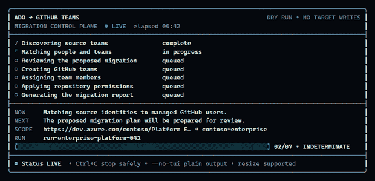
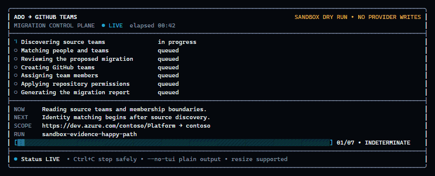
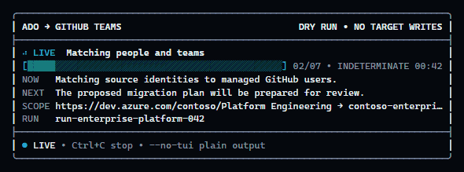
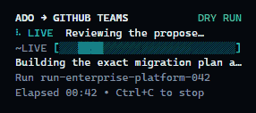
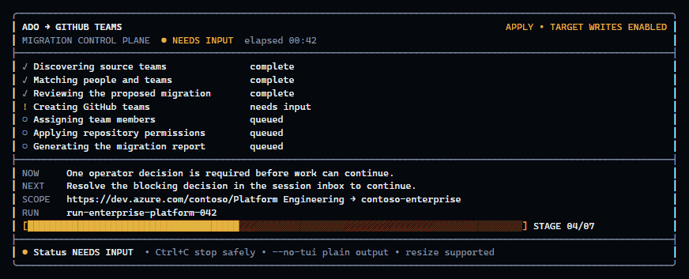
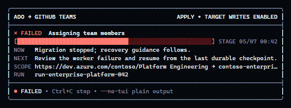
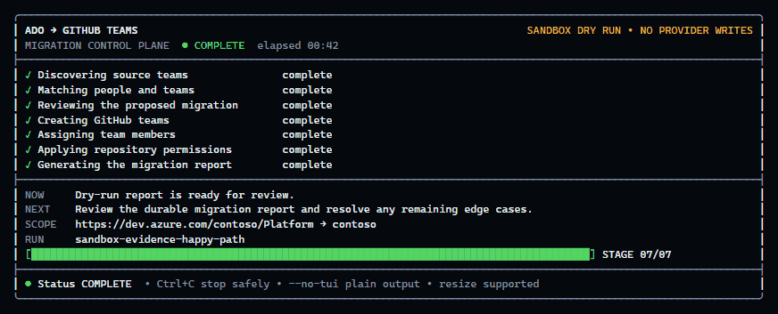
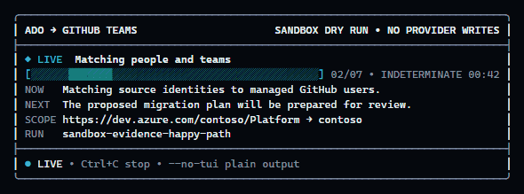

# TUI experience and review evidence

The migration TUI is a responsive, alternate-screen control plane for interactive sandbox and
foreground runs. It uses synchronized atomic redraw, bounded animation, resize recomposition, explicit
safety state, and a deduplicated line-oriented fallback for non-TTY, CI, reduced-motion, and
screen-reader contexts.

## Review personas

| Persona | Context | Review focus |
| --- | --- | --- |
| Avery, advanced agentic TUI operator | Uses Claude Code CLI and Grok Build daily | Live state density, elapsed progress, stable redraw, resize, shortcuts, and plain-output escape |
| Priya, enterprise TUI designer | Reviews corporate operational interfaces | Hierarchy, semantic color with text redundancy, responsive density, restrained motion, and evidence quality |
| Jordan, nonvisual operator | Uses a screen reader and line-oriented terminal output | No cursor controls, no color-only meaning, deduplicated textual updates, and reduced motion |
| Morgan, terminal reliability reviewer | Adversarially tests terminal behavior | Signal cleanup, control-sequence injection, Unicode cell width, frame bounds, and prompt compatibility |

## Executable scenarios

The adjacent [`tui-experience.feature`](tui-experience.feature) covers:

1. stable animated frame shape and explicitly indeterminate throughput;
2. wide, standard, narrow, and minimal resize bounds;
3. deduplicated plain live progress without ANSI cursor controls;
4. reduced-motion semantic status;
5. multiline and terminal-control injection resistance; and
6. alternate-screen and cursor restoration.

## Latest production-renderer evidence

All evidence uses synthetic identifiers and is generated from the same renderer used by the CLI.

| State | Evidence |
| --- | --- |
| Live progress animation |  |
| Wide live state |  |
| Standard 80-column state |  |
| Narrow resize edge |  |
| Blocking decision |  |
| Failure and recovery |  |
| Completion receipt |  |
| Reduced motion |  |

## Change and pull request gate

Every TUI behavior or visual change must:

1. update the focused unit/integration tests and the adjacent Gherkin scenarios;
2. run `pnpm test:bdd`, the focused TUI tests, and `pnpm check`;
3. install Pillow once with `python -m pip install Pillow`, then run `pnpm tui:evidence`;
4. review and commit the refreshed PNG/GIF evidence in `evidence/tui/`; and
5. embed the relevant committed PNG/GIF files plus exact test commands in the pull request body so
   reviewers can evaluate the experience without running the application.

Generated migration reports, tenant data, credentials, and non-synthetic traces must never appear in
visual evidence or pull request content.
